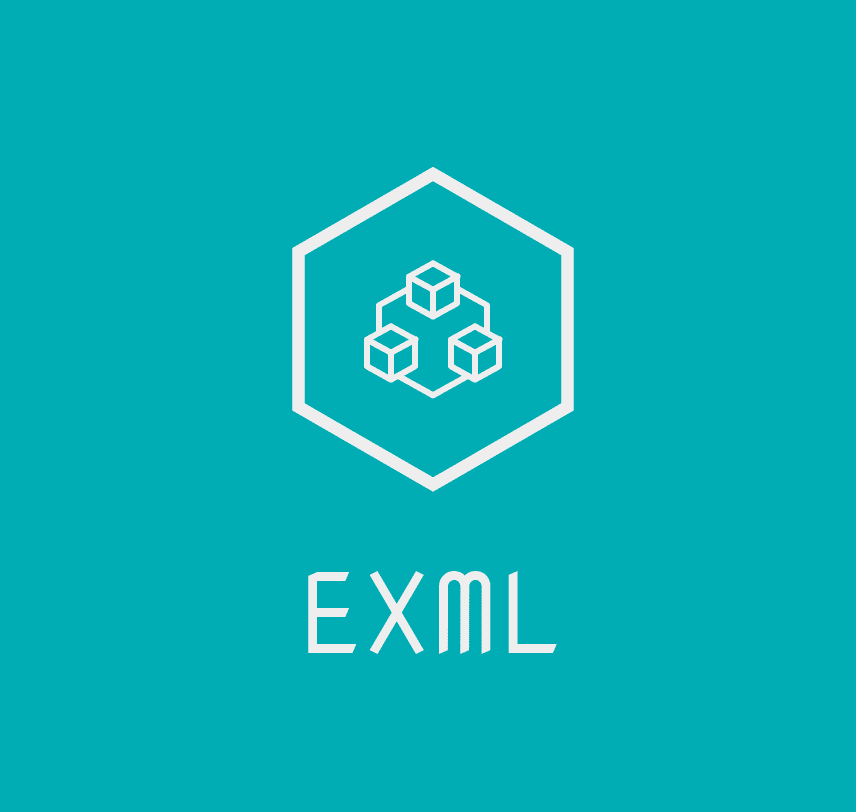

<div align="center">
  <br>
  
  <h1>exml</h1>
  <strong>A Simple flask app for Automating Excel data into XML templates</strong>
</div>
<br>
<p align="center">
  
  
</p>

exml is a simple flask app who's main purpose is to quickly input spreadsheet data into an xml template.

## 📖 Prerequisites

In order to run the project we need `python>=3.12` and `uv` for package management.

Install uv following the [offical repo](https://github.com/astral-sh/uv?tab=readme-ov-file#getting-started)

## 🖥️ Local development

To install the application:

```shell
uv sync --frozen --no-cache
```

To start a local copy of the app on port `3000`:

```shell
uv run -- flask run -p 3000
```

### 🧪 Test
This project uses pytest for test discovery. Simply run:
```shell
pytest
```
test_FILENAME.py will be auto discovered and tests will run

### 📦 Docker builds

Simply build the dockerfile in your prefered architecture with (select arch with --platform= otherwise it defaults to your system):
```shell
docker build -t exml-local.
```

Then run it!
```shell
docker run -d -p 80:80 exml-local
```

### 🎨 Code linting

To check the code and styles quality, use the following command:

```shell
# Lint your code
uv run ruff check

# Format your code
uv run ruff check
```

### 🚀 Production deployment

<strong>TBD</strong>

### 💾 Data

All files are saved locally. Uploads in the ./uploads directory and the resulting xml in output_xmls. 

## 🤝 Contributing

<strong>TBD</strong>

## 🍕 Community

This tool was sponsored and inspired by University of Berkeley Middle Eastern Languages and Cultures (MELC) Department! 

## ⚖️ LICENSE

MIT © [exml](LICENSE)
